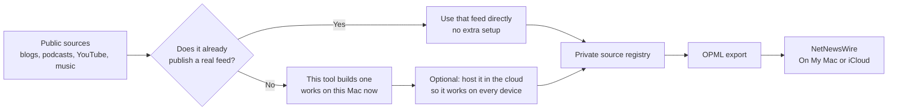
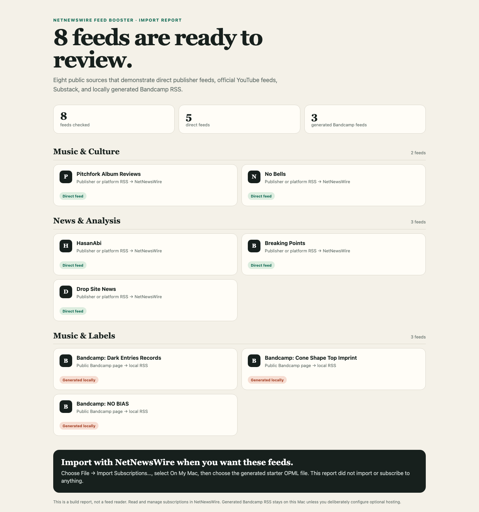
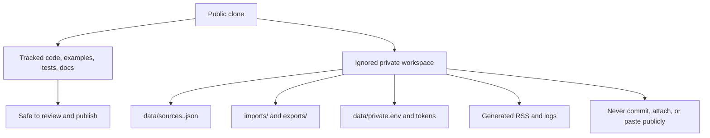

# NetNewsWire Feed Booster

> An independent companion tool for [NetNewsWire](https://netnewswire.com/), not a fork or official integration.

[](https://github.com/spkerber/netnewswire-feed-booster/actions/workflows/test.yml)
[](https://github.com/spkerber/netnewswire-feed-booster/releases)
[](LICENSE)

NetNewsWire Feed Booster helps you collect, organize, and move RSS subscriptions without making a social platform your reading environment. It keeps a private, portable registry of feed metadata, exports clean OPML, and generates RSS only when a public source does not offer a useful native feed.

Read and manage subscriptions in NetNewsWire. This project does not store articles, scrape private accounts, change upstream subscriptions, or track what you read.



It is designed for slow, intentional catch-up rather than minute-by-minute monitoring. See [Slow Reading And Refresh Policy](docs/reading-practice.md) for the default cadence, capacity, storage model, and tuning tradeoffs.

## Build A Starter Import

The starter import runs the registry, validation, generated-feed, and OPML code against eight public sources. It includes Pitchfork album reviews, No Bells, HasanAbi, Breaking Points, Drop Site News, and the Dark Entries Records, Cone Shape Top Imprint, and NO BIAS Bandcamp pages.



The browser page is an import report. It shows what the command built before you decide whether to import the OPML. It is not a feed reader or a second subscription-management interface.

On a Mac with Python 3 installed:

1. Download and unzip this repository.
2. Double-click **Build Starter Import.command**.
3. Review the report, then import `starter-netnewswire.opml` from `exports/` only if you want those feeds in NetNewsWire.

From a terminal, the same workflow is:

```bash
./scripts/build_starter_import.sh starter --open
```

It makes public network requests to validate the five direct feeds and generate three local Bandcamp feeds. It does not open, edit, or import anything into NetNewsWire. Existing starter files are never overwritten unless you deliberately add `--force`.

## Choose Your Path

| You want to... | Start here | What you need |
| --- | --- | --- |
| Build and review a starter OPML import | Double-click `Build Starter Import.command` | Mac, Finder, and Python 3.9+ |
| Add one native feed without this tool | [GUI workflow](docs/setup.md#gui-first-workflow-no-terminal) | NetNewsWire |
| Keep a portable source registry yourself | [Terminal workflow](docs/setup.md#terminal-workflow) | Git and Python 3.9+ |
| Set up or migrate with a local coding agent | [Agent-assisted workflow](docs/agent-assisted-setup.md) | A local clone and a coding harness |
| Import subscriptions from platforms | [What goes in `imports/`](imports/README.md) | An OPML file, a supported export, or public URLs |
| Add Bandcamp, NTS, Mixcloud, or a supported webpage recipe | [Generated feeds](docs/source-types.md#generated-rss) | Terminal or local coding agent; optional HTTPS host |

Start with NetNewsWire's [download page](https://netnewswire.com/). Choose `On My Mac` for a single-Mac trial or an isolated migration. Choose `iCloud` only when you are ready to sync subscriptions and reading state between Apple devices. NetNewsWire’s [getting-started guide](https://netnewswire.com/help/mac/6.1/en/getting-started.html) explains both account choices.

## Requirements

Python 3.9 or later, and nothing else. The tool runs on the standard library, so there is no `pip install` step, no lockfile, and no virtual environment to manage. Clone it and it works.

**Do not install Python to satisfy this.** 3.9 is the oldest version supported, not a recommended one. It is the floor because that is what macOS ships as `/usr/bin/python3`, so an untouched Mac already meets it. Check before installing anything:

```bash
python3 --version
```

Anything 3.9 or later and you are done. If you are below it, or on a system with no `python3`, install a current Python 3 — newer is better, and the whole supported range behaves identically. Do not install 3.9 specifically, and do not add a second Python beside one that already works.

| What you're doing | What you need |
| --- | --- |
| Starter import, registry, OPML export, generated feeds | Python 3.9+, which macOS already has |
| Double-clicking `Build Starter Import.command` | macOS with Finder |
| `git clone` and the `make` shortcuts | Git, GNU Make, and Bash |
| Hosting generated feeds so they refresh on their own | The optional `modal` extra, below |
| `scripts/verify_public_template.sh` before publishing a clone | [ripgrep](https://github.com/BurntSushi/ripgrep) (`rg`) |

The test suite runs on Python 3.9 and 3.13 on Linux and on Python 3.13 on macOS. Anything in that range behaves the same.

### Optional: The Hosted Bridge

One file needs third-party packages: `modal_bandcamp_app.py`, and only when you run the [hosted bridge](docs/hosting.md). `pyproject.toml` declares them as the `modal` extra.

| Package | Minimum | What it does |
| --- | --- | --- |
| `modal` | 1.5.3 | Runs the bridge and its refresh schedule |
| `fastapi[standard]` | 0.115.8 | Serves the feed endpoints |

Install them into their own virtual environment so the tool itself stays dependency-free:

```bash
python3 -m venv .venv-modal
.venv-modal/bin/python -m pip install -e ".[modal]"
```

## Fast Start: Terminal

```bash
git clone https://github.com/spkerber/netnewswire-feed-booster.git my-rss-stack
cd my-rss-stack
export PYTHONPATH=src
./scripts/bootstrap_profile.sh me
export RSS_PROFILE=me
make test
```

Use `--force` only when you have intentionally decided to replace an existing private profile. A profile-aware command now fails closed if setup was skipped; it never falls back to the tracked starter data.

Export an account from NetNewsWire as OPML, put it in ignored `imports/`, then create a cleaned candidate export:

```bash
PYTHONPATH=src python3 -m netnewswire_feed_booster \
  import-opml imports/netnewswire.opml --profile "$RSS_PROFILE"
PYTHONPATH=src python3 -m netnewswire_feed_booster \
  export-opml --profile "$RSS_PROFILE" \
  --out "exports/${RSS_PROFILE}-netnewswire.opml"
```

Review the candidate before importing it back into NetNewsWire. The full, visual walkthrough is in [Setup](docs/setup.md).

## How Feeds Actually Work Here

Most of what you'll add — podcasts, Substack newsletters, YouTube channels, SoundCloud profiles — already publishes its own real RSS feed. NetNewsWire reads that feed straight from the publisher, on its own schedule, on every device you use. This tool never touches the content in between. When a real feed like this exists, it's always what gets used.

A few platforms never publish a real feed at all — Bandcamp is the main one, along with NTS and Mixcloud. For those, this tool builds one for you: it reads the public page and writes a small RSS file. That file works immediately, for free, with no extra setup — NetNewsWire can read it right away. The catch is that a file on your Mac only exists on your Mac. It won't show up in NetNewsWire on your iPhone, and it won't update itself; you have to re-run the tool to refresh it.

If you want one of those generated feeds to update on its own and reach your other devices — the way a real feed does — the file needs to live somewhere with a public web address instead of just on your hard drive. That's what the **hosted bridge** is: the same feed-building logic, running continuously on a small cloud service (this project uses [Modal](docs/hosting.md)) instead of your Mac, refreshing itself on a schedule and serving a normal `https://` URL that any device can reach. It's entirely optional, costs a small amount if you turn it on, and you don't need it at all if you only ever read on one Mac.

See [Source Types](docs/source-types.md) for exactly which platforms fall into each category, and [Hosted Bridge](docs/hosting.md) if you decide you want the cloud option.

## Privacy Boundary

The tracked starter files are safe examples. Your real registry, OPML exports, generated RSS, imported exports, logs, tokens, and subscriber-only feeds are local artifacts and ignored by default.



`bootstrap_profile.sh` validates the profile name, preflights every target before writing, and creates owner-only ignored files such as `data/sources.me.json` and `data/subscription-history.me.json`. Keep a personal working copy private. A populated registry or OPML can reveal interests, habits, and private feed URLs.

Before publishing a derivative or sharing a clone, run:

```bash
./scripts/verify_public_template.sh
```

See [Public Release](docs/public-release.md) for the full release checklist.

## Documentation

- [What Goes In `imports/`](imports/README.md): per-source table of what to save, where, and the exact command to run — start here if you have a file (or a URL) and just want to know what to do with it.
- [Setup](docs/setup.md): visual first-run guide for GUI, terminal, and iCloud/On My Mac choices.
- [First Import](docs/first-feed.md): public starter report, one-feed fallback, import success check, troubleshooting, and FAQ.
- [Collect Sources](docs/source-collection.md): existing OPML, YouTube exports and URLs, Bandcamp, podcasts, Substack, and supported input formats.
- [Agent-Assisted Setup](docs/agent-assisted-setup.md): a safe handoff prompt and approval boundaries for local coding harnesses.
- [Operations](docs/operations.md): daily, weekly, and occasional maintenance routines.
- [Source Types](docs/source-types.md): direct feeds versus generated RSS.
- [Slow Reading And Refresh Policy](docs/reading-practice.md): cadence, capacity, storage, and tuning tradeoffs.
- [Writing A Source Adapter](docs/writing-a-source-adapter.md): security and testing contract for a new generated source type.
- [Writing A Direct Feed Source](docs/writing-a-direct-feed-source.md): the equivalent contract for a source with its own native feed URL — YouTube, SoundCloud, Substack, Podcasts.
- [Hosted Bridge](docs/hosting.md): tokenized generated feeds and supported host options.
- [Contributing](CONTRIBUTING.md): scope and privacy requirements for contributors, and how `batch-subscribe` dispatches.
- [Changelog](CHANGELOG.md): what changed in each release, including upgrade notes.

## License And Community

This project is [MIT licensed](LICENSE). NetNewsWire is a separate project; use its interface to read and manage subscriptions. See [docs/netnewswire-community-note.md](docs/netnewswire-community-note.md) for an accurate community post.
