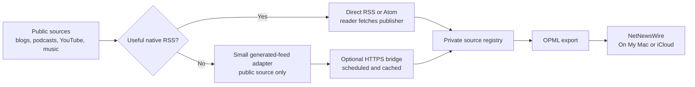
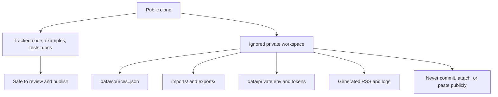

# NetNewsWire Feed Booster

> An independent companion tool for [NetNewsWire](https://netnewswire.com/), not a fork or official integration.

NetNewsWire Feed Booster helps you collect, organize, and move RSS subscriptions without making a social platform your reading environment. It keeps a private, portable registry of feed metadata, exports clean OPML, and generates RSS only when a public source does not offer a useful native feed.

NetNewsWire remains the reader. This project does not store articles, scrape private accounts, change upstream subscriptions, or track what you read.



It is designed for slow, intentional catch-up rather than minute-by-minute monitoring. See [Slow Reading And Refresh Policy](docs/reading-practice.md) for the default cadence, capacity, storage model, and tuning tradeoffs.

## Choose Your Path

| You want to... | Start here | What you need |
| --- | --- | --- |
| See one feed load before anything else | [First Feed](docs/first-feed.md) | NetNewsWire; no repository or host required |
| Try RSS without coding | [GUI workflow](docs/setup.md#gui-first-workflow-no-terminal) | NetNewsWire and Finder |
| Keep a portable source registry yourself | [Terminal workflow](docs/setup.md#terminal-workflow) | Git and Python 3.9+ |
| Set up or migrate with a local coding agent | [Agent-assisted workflow](docs/agent-assisted-setup.md) | A local clone and a coding harness |
| Import subscriptions from platforms | [Collect sources](docs/source-collection.md) | An OPML file, a supported export, or public URLs |
| Add Bandcamp, NTS, HydeFM, or Mixcloud | [Generated feeds](docs/source-types.md#generated-rss) | Terminal or local coding agent; optional HTTPS host |

Start with NetNewsWire's [download page](https://netnewswire.com/). Choose `On My Mac` for a single-Mac trial or an isolated migration. Choose `iCloud` only when you are ready to sync subscriptions and reading state between Apple devices. NetNewsWire’s [getting-started guide](https://netnewswire.com/help/mac/6.1/en/getting-started.html) explains both account choices.

## Fast Start: Terminal

```bash
git clone <repository-url> my-rss-stack
cd my-rss-stack
export PYTHONPATH=src
./scripts/bootstrap_profile.sh me
export RSS_PROFILE=me
make test
```

Use `--force` only when you have intentionally decided to replace an existing private profile. Start with [First Feed](docs/first-feed.md) if you have not yet seen a feed load in NetNewsWire.

Export an account from NetNewsWire as OPML, put it in ignored `imports/`, then create a cleaned candidate export:

```bash
PYTHONPATH=src python3 -m netnewswire_feed_booster \
  import-opml imports/netnewswire.opml --profile "$RSS_PROFILE"
PYTHONPATH=src python3 -m netnewswire_feed_booster \
  export-opml --profile "$RSS_PROFILE" \
  --out "exports/${RSS_PROFILE}-netnewswire.opml"
```

Review the candidate before importing it back into NetNewsWire. The full, visual walkthrough is in [Setup](docs/setup.md).

## Direct Versus Generated Feeds

Keep native HTTPS RSS, Atom, and JSON feeds direct. They are more reliable, respect the publisher’s intended delivery, and use no bridge resources. This includes publisher feeds, podcasts, Substack publications, and official YouTube channel feeds.

Use a generated feed only for a public source without a useful native feed, such as a Bandcamp page, NTS show, HydeFM archive, or public Mixcloud profile. Generated sources are optional; they need a local command or coding agent, and NetNewsWire may need an HTTPS bridge rather than a `file://` URL. See [Source Types](docs/source-types.md) and [Hosted Bridge](docs/hosting.md).

## Privacy Boundary

The tracked starter files are safe examples. Your real registry, OPML exports, generated RSS, imported exports, logs, tokens, and subscriber-only feeds are local artifacts and ignored by default.



`bootstrap_profile.sh` creates the ignored profile files you edit, such as `data/sources.me.json` and `data/subscription-history.me.json`. Keep a personal working copy private. A populated registry or OPML can reveal interests, habits, and private feed URLs.

Before publishing a derivative or sharing a clone, run:

```bash
./scripts/verify_public_template.sh
```

See [Public Release](docs/public-release.md) for the full release checklist.

## Documentation

- [Setup](docs/setup.md): visual first-run guide for GUI, terminal, and iCloud/On My Mac choices.
- [First Feed](docs/first-feed.md): no-risk first-feed test, import success check, troubleshooting, and FAQ.
- [Collect Sources](docs/source-collection.md): existing OPML, YouTube exports and URLs, Bandcamp, podcasts, Substack, and supported input formats.
- [Agent-Assisted Setup](docs/agent-assisted-setup.md): a safe handoff prompt and approval boundaries for local coding harnesses.
- [Operations](docs/operations.md): daily, weekly, and occasional maintenance routines.
- [Source Types](docs/source-types.md): direct feeds versus generated RSS.
- [Slow Reading And Refresh Policy](docs/reading-practice.md): cadence, capacity, storage, and tuning tradeoffs.
- [Writing A Source Adapter](docs/writing-a-source-adapter.md): security and testing contract for a new generated source type.
- [Hosted Bridge](docs/hosting.md): tokenized generated feeds and supported host options.
- [Contributing](CONTRIBUTING.md): scope and privacy requirements for contributors.

## License And Community

This project is [MIT licensed](LICENSE). NetNewsWire is a separate project and remains the reading UI. See [docs/netnewswire-community-note.md](docs/netnewswire-community-note.md) for an accurate community post.
