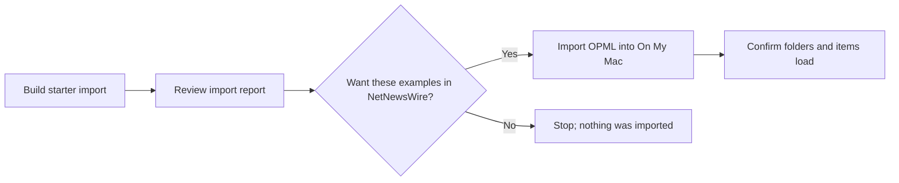

# First Import: From Public Sources To NetNewsWire

Use this once to build a reviewable OPML import before working with your own source list, setting up a host, or using iCloud. The starter import uses eight public sources and writes only ignored local files. You do not need Modal, a token, or a coding agent.



## Option A: Build A Starter Import

This route runs the source registry, feed validation, generated Bandcamp adapters, and OPML export.

1. Download the repository ZIP from [GitHub](https://github.com/spkerber/netnewswire-feed-booster), then unzip it.
2. Confirm `python3 --version` reports Python 3.9 or later. If you are unsure, double-clicking the file below will give you a direct error instead of changing anything.
3. Double-click **Build Starter Import.command** in the unzipped folder.
4. Wait while it validates five direct public feeds and generates RSS for three public Bandcamp label pages.
5. Review the import report that opens.


The command creates an ignored `starter` profile, an HTML import report, three local RSS files, and `exports/starter-netnewswire.opml`. The report is a build receipt, not a reader. The command does not open or alter NetNewsWire. If the profile already exists, it stops rather than overwriting it.

To try the import:

1. Open NetNewsWire and use its built-in **On My Mac** account.
2. Choose **File > Import Subscriptions...**.
3. Select `starter-netnewswire.opml` from this repository’s `exports/` folder.
4. Confirm these three folders appear: **Music & Culture**, **News & Analysis**, and **Music & Labels**.
5. Select a direct feed and a Bandcamp feed and confirm items load.

NetNewsWire’s [OPML import guide](https://netnewswire.com/help/mac/6.0/en/import-opml.html) confirms that importing adds subscriptions to the account you select. It does not replace another account or delete existing feeds.

## Option B: One Native Feed, No Product Setup

1. Download and open [NetNewsWire](https://netnewswire.com/).
2. Use its built-in **On My Mac** account. You do not need to add an account to read on one Mac. Add iCloud later only if you want synced subscriptions and reading state across Apple devices. See NetNewsWire’s [getting-started guide](https://netnewswire.com/help/mac/6.1/en/getting-started.html).
3. Copy this public direct feed URL:

```text
https://www.youtube.com/feeds/videos.xml?channel_id=UC_x5XG1OV2P6uZZ5FSM9Ttw
```

4. In NetNewsWire, click `+`, choose **New Web Feed**, paste the URL, and add it to **On My Mac**.
5. Select the new feed in the sidebar. Its title should appear and it should load items after a short wait.

That is a NetNewsWire-only checkpoint. It proves the reader can load a native feed, but it does not exercise Feed Booster.

## Option C: Terminal

Run the same eight-source starter workflow from a shell:

```bash
git clone https://github.com/spkerber/netnewswire-feed-booster.git
cd netnewswire-feed-booster
./scripts/build_starter_import.sh starter --open
```

For your own private source list, continue with the [Terminal Workflow](setup.md#terminal-workflow). Create a different profile rather than repurposing the public starter.

## When To Use iCloud

After the **On My Mac** test works, you can deliberately migrate subscriptions to iCloud:

1. In NetNewsWire, export the working **On My Mac** subscriptions as OPML.
2. Choose **File > Import Subscriptions...** and select **iCloud** exactly once.
3. Confirm the same feed appears in iCloud, then let its initial sync finish before further changes.

OPML moves subscription lists and folders, not your old local read/unread history. Keep the On My Mac account until you have confirmed the iCloud import; do not import the same OPML into both accounts repeatedly.

## Troubleshooting

| What you see | What to do |
| --- | --- |
| `Build Starter Import.command` will not open | Control-click it, choose **Open**, and confirm. macOS may ask once because it came from a downloaded ZIP. |
| The starter profile already exists | Stop and review it. Use a different profile name from Terminal; use `--force` only when intentionally replacing the public example files. |
| A public validation request fails | The script leaves the existing profile untouched. Check your connection, then retry; upstream sites can be temporarily unavailable. |
| The feed title does not appear | Confirm you selected **On My Mac**, then try adding the direct URL again. Do not set up Modal. |
| The title appears but no items yet | Keep the feed selected briefly, then refresh NetNewsWire. Public feeds can have no recent items or a temporary upstream delay. |
| `python3` is missing or older than 3.9 | Use the GUI-only path, install a current Python, or ask a local coding agent to perform the terminal workflow. |
| `bootstrap_profile.sh` refuses to overwrite a file | Stop. Pick a new profile name or inspect the existing private profile. Use `--force` only when intentionally discarding that profile. |
| You imported into iCloud by mistake | Do not import again. Export a backup, verify the feed list, and clean up deliberately in NetNewsWire. |
| A Bandcamp or Mixcloud source fails on another device | A local `file://` feed is checkout-specific. Read [Hosted Bridge](hosting.md) before deciding whether optional HTTPS hosting is justified. |

## FAQ

### Do I need this repository to use RSS?

No. NetNewsWire alone is sufficient for direct RSS, Atom, and JSON feeds. This project helps with portable source metadata, OPML import/export, bulk cleanup, and a few generated public feeds.

### Is my OPML private?

Treat it as private. It can reveal interests, private feed URLs, and tokenized hosted-feed URLs. Keep it in `imports/` or `exports/`, which are ignored by Git; never attach it to a public issue or chat.

### Do I need Modal?

No. Direct publisher feeds, podcasts, Substack, and official YouTube feeds do not need it. Modal is an optional, supported host only for generated sources that need HTTPS outside your local checkout.

### What is a coding harness?

It is a local coding agent that can work inside your cloned folder on your Mac, such as Codex, Cursor, or Claude Code. It is not a reason to upload your OPML, tokens, or `.env` files to a public web chat. Use the approval rules in [Agent-Assisted Setup](agent-assisted-setup.md).

### Why does `audit-sources` contact websites?

It fetches active feeds to validate their formats, which reveals your IP address to those public sources. Skip it for this first-feed test; run it later when you deliberately review a larger import.

### Can an agent deploy a host or modify NetNewsWire for me?

Only after you approve the exact command and effect. It must ask before deployment, creating provider resources, importing OPML, replacing reader files, deleting sources, rotating tokens, committing, or pushing.
