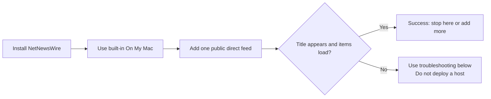

# First Feed: From Link To Loaded Item

Start here if you want to prove RSS works before importing a large source list, setting up a host, or using iCloud. This guide deliberately uses one public, direct YouTube feed. You do not need Modal, a token, or a coding agent.



## Option A: No Terminal

1. Download and open [NetNewsWire](https://netnewswire.com/).
2. Use its built-in **On My Mac** account. You do not need to add an account to read on one Mac. Add iCloud later only if you want synced subscriptions and reading state across Apple devices. See NetNewsWire’s [getting-started guide](https://netnewswire.com/help/mac/6.1/en/getting-started.html).
3. Copy this public direct feed URL:

```text
https://www.youtube.com/feeds/videos.xml?channel_id=UC_x5XG1OV2P6uZZ5FSM9Ttw
```

4. In NetNewsWire, click `+`, choose **New Web Feed**, paste the URL, and add it to **On My Mac**.
5. Select the new feed in the sidebar. Its title should appear and it should load items after a short wait.

That is the first-success checkpoint. If it works, RSS and NetNewsWire are ready. You can keep adding direct feeds in the GUI, or continue with this repository when you want a portable registry, a bulk OPML cleanup, or a supported generated source.

## Option B: First Feed Through This Repository

Use this path when you want to see the complete local-registry-to-OPML-to-NetNewsWire workflow before importing your real sources.

### 1. Get a Local Copy

With Git and Terminal:

```bash
git clone <repository-url> my-rss-stack
cd my-rss-stack
python3 --version
```

On the GitHub page you opened, use **Code > Local** to copy its HTTPS clone URL and replace `<repository-url>`. Python must report version 3.9 or later. If you do not use Git, download the repository ZIP from GitHub, unzip it in Finder, and open that folder in Terminal or a local coding harness. The command steps below are the same once you are inside the unzipped folder.

### 2. Create a New Private Profile

```bash
export PYTHONPATH=src
./scripts/bootstrap_profile.sh first
export RSS_PROFILE=first
```

Do **not** add `--force` during ordinary setup. The script refuses to overwrite a profile so that your private registry cannot be replaced by accident.

### 3. Add One Direct Feed and Export OPML

```bash
PYTHONPATH=src python3 -m netnewswire_feed_booster \
  --data "data/sources.${RSS_PROFILE}.json" \
  subscribe-youtube UC_x5XG1OV2P6uZZ5FSM9Ttw \
  --title "Google Developers" --profile "$RSS_PROFILE"

PYTHONPATH=src python3 -m netnewswire_feed_booster \
  --data "data/sources.${RSS_PROFILE}.json" \
  export-opml --profile "$RSS_PROFILE" \
  --out "exports/${RSS_PROFILE}-netnewswire.opml"
```

This path does not fetch or validate the feed. It writes only an ignored private registry and an ignored local OPML export. The reader will fetch the public feed after you import it.

### 4. Import the Candidate Into NetNewsWire

1. In Finder, open your `my-rss-stack` folder, then open `exports/`.
2. In NetNewsWire, choose **File > Import Subscriptions...**.
3. Select **On My Mac** as the target account.
4. Choose `first-netnewswire.opml` from `exports/`.
5. Confirm **Google Developers** appears in the **On My Mac** sidebar, select it, and wait for items to load.

NetNewsWire’s [OPML import guide](https://netnewswire.com/help/mac/6.0/en/import-opml.html) confirms that importing adds subscriptions to the selected account. It does not replace your other account or delete its feeds.

## When To Use iCloud

After the **On My Mac** test works, you can deliberately migrate subscriptions to iCloud:

1. In NetNewsWire, export the working **On My Mac** subscriptions as OPML.
2. Choose **File > Import Subscriptions...** and select **iCloud** exactly once.
3. Confirm the same feed appears in iCloud, then let its initial sync finish before further changes.

OPML moves subscription lists and folders, not your old local read/unread history. Keep the On My Mac account until you have confirmed the iCloud import; do not import the same OPML into both accounts repeatedly.

## Troubleshooting

| What you see | What to do |
| --- | --- |
| The feed title does not appear | Confirm you selected **On My Mac**, then try adding the direct URL again. Do not set up Modal. |
| The title appears but no items yet | Keep the feed selected briefly, then refresh NetNewsWire. Public feeds can have no recent items or a temporary upstream delay. |
| `python3` is missing or older than 3.9 | Use the GUI-only path, install a current Python, or ask a local coding agent to perform the terminal workflow. |
| `bootstrap_profile.sh` refuses to overwrite a file | Stop. Pick a new profile name or inspect the existing private profile. Use `--force` only when intentionally discarding that profile. |
| You imported into iCloud by mistake | Do not import again. Export a backup, verify the feed list, and clean up deliberately in NetNewsWire. |
| A Bandcamp or Mixcloud source fails on another device | A local `file://` feed is checkout-specific. Read [Hosted Bridge](hosting.md) before deciding whether optional HTTPS hosting is justified. |

## FAQ

### Do I need this repository to use RSS?

No. NetNewsWire alone is sufficient for direct RSS, Atom, and JSON feeds. This project helps with portable source metadata, OPML import/export, bulk cleanup, and a few generated public feeds.

### Is my OPML private?

Treat it as private. It can reveal interests, private feed URLs, and tokenized hosted-feed URLs. Keep it in `imports/` or `exports/`, which are ignored by Git; never attach it to a public issue or chat.

### Do I need Modal?

No. Direct publisher feeds, podcasts, Substack, and official YouTube feeds do not need it. Modal is an optional, supported host only for generated sources that need HTTPS outside your local checkout.

### What is a coding harness?

It is a local coding agent that can work inside your cloned folder on your Mac, such as Codex, Cursor, or Claude Code. It is not a reason to upload your OPML, tokens, or `.env` files to a public web chat. Use the approval rules in [Agent-Assisted Setup](agent-assisted-setup.md).

### Why does `audit-sources` contact websites?

It fetches active feeds to validate their formats, which reveals your IP address to those public sources. Skip it for this first-feed test; run it later when you deliberately review a larger import.

### Can an agent deploy a host or modify NetNewsWire for me?

Only after you approve the exact command and effect. It must ask before deployment, creating provider resources, importing OPML, replacing reader files, deleting sources, rotating tokens, committing, or pushing.
