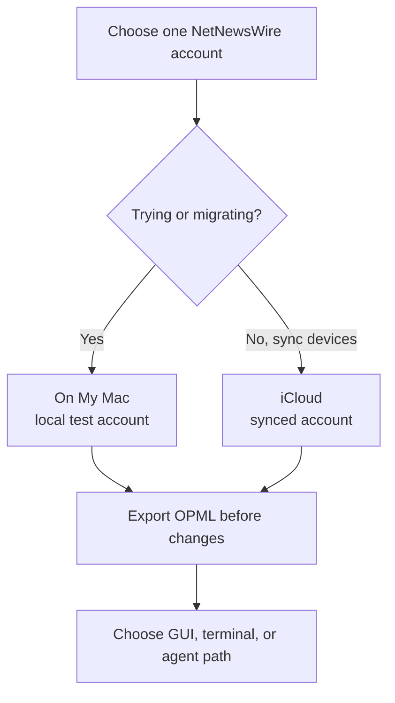
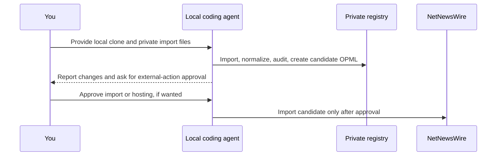

# Setup

This guide has three paths. Start with the one that matches how you want to work. You can move to another later without losing your subscriptions because OPML and the private registry are portable.

| Path | Best for | Requires |
| --- | --- | --- |
| GUI-first | Reading and adding native feeds without a terminal | NetNewsWire and Finder |
| Terminal | Keeping a versioned, local registry yourself | Git and Python 3.9+ |
| Agent-assisted | A semi-technical setup with reviewable automation | A local clone and a coding harness |

## Before You Start

1. Download [NetNewsWire](https://netnewswire.com/) for Mac, iPhone, or iPad.
2. On Mac, start with the built-in `On My Mac` account for an isolated trial or a large first import. You do not need to add an account for one-Mac reading.
3. Add `iCloud` only when you are ready to sync subscriptions and reading state across Apple devices.
4. Do not import the same OPML into both accounts unless you deliberately want two copies.

NetNewsWire documents [account setup](https://netnewswire.com/help/mac/6.1/en/getting-started.html), [OPML export](https://netnewswire.com/help/mac/6.0/en/export-opml.html), and [OPML import](https://netnewswire.com/help/mac/6.0/en/import-opml.html).



## GUI-First Workflow (No Terminal)

Use this path when you only need native feeds and want NetNewsWire to be the entire workflow. It does not add generated Bandcamp, NTS, HydeFM, or Mixcloud feeds; those need the terminal or a local coding agent.

For the shortest path from download to a verified working feed, follow [First Feed](first-feed.md) before adding your own sources.

### Add a Feed Manually

1. In a browser, open the publication or creator you want to follow.
2. Prefer the publisher’s RSS, Atom, or podcast feed URL. For a YouTube channel, use the channel URL or its official RSS URL from [Collect Sources](source-collection.md#youtube).
3. In NetNewsWire, click the `+` button and choose **New Web Feed**, then paste the URL. NetNewsWire can often discover a feed from the site URL.
4. Place it in the appropriate folder in the sidebar.

### Export a Backup or Move Between Accounts

1. Choose **File > Export Subscriptions...** in NetNewsWire.
2. Select the account to export and save the `.opml` file in a private Finder location.
3. To import, choose **File > Import Subscriptions...**, select the target account, then select the OPML file.
4. Let iCloud finish its first sync before making more subscription changes.

An OPML import adds subscriptions. It is not a backup restore and does not delete the old account by itself. Keep the exported OPML private because it can reveal your interests and private feed URLs.

### Use Finder Safely

Keep personal files outside a public clone or in the clone’s ignored directories:

```text
my-rss-stack/
  imports/                 # private OPML and platform exports
  exports/                 # private candidate OPML and generated RSS
  data/sources.me.json     # private registry
  data/private.env         # private host configuration and token
```

Finder can show hidden files with `Command-Shift-.` if you need to verify `.gitignore`, but do not drag a `.env`, OPML export, or profile JSON into GitHub or a public chat.

When you need hosted generated feeds, create the ignored environment file with owner-only permissions so its token is not readable by other local accounts:

```bash
install -m 600 examples/private.env.example data/private.env
```

## Terminal Workflow

### 1. Create a Private Working Copy

```bash
git clone <repository-url> my-rss-stack
cd my-rss-stack
export PYTHONPATH=src
./scripts/bootstrap_profile.sh me
export RSS_PROFILE=me
make test
./scripts/verify_public_template.sh
```

The bootstrap script creates ignored profile-specific `sources`, `subscription-history`, and `profiles` files. The tracked `data/*.json` files are public starter examples; do not add your subscriptions there. Do not use `--force` unless you intentionally want to overwrite an existing profile.

### 2. Import Your Existing OPML Locally

In NetNewsWire, export the account you selected. Save the result as `imports/netnewswire.opml`, then run:

```bash
PYTHONPATH=src python3 -m netnewswire_feed_booster \
  --data "data/sources.${RSS_PROFILE}.json" \
  import-opml imports/netnewswire.opml --profile "$RSS_PROFILE"

PYTHONPATH=src python3 -m netnewswire_feed_booster \
  --data "data/sources.${RSS_PROFILE}.json" \
  audit-sources --profile "$RSS_PROFILE" --limit 25
```

This changes only the local private registry. It does not modify NetNewsWire or follow/unfollow any platform account. `audit-sources` makes outbound requests to each selected feed to validate it, which reveals your IP address to those public sources. Skip the audit for a no-network first test; run it before a large import or cleanup.

### 3. Collect and Add Sources

Use [Collect Sources](source-collection.md) for exact URL examples and supported uploads. For example:

```bash
# A single YouTube channel URL; the tool resolves the stable official channel RSS.
PYTHONPATH=src python3 -m netnewswire_feed_booster \
  --data "data/sources.${RSS_PROFILE}.json" \
  import-youtube-channel-url https://www.youtube.com/@example --profile "$RSS_PROFILE"

# A public Bandcamp root page, not an album page.
PYTHONPATH=src python3 -m netnewswire_feed_booster \
  --data "data/sources.${RSS_PROFILE}.json" \
  subscribe-bandcamp-source https://artist.bandcamp.com/ --profile "$RSS_PROFILE"
```

### 4. Export a Candidate OPML

```bash
PYTHONPATH=src python3 -m netnewswire_feed_booster \
  --data "data/sources.${RSS_PROFILE}.json" \
  export-opml --profile "$RSS_PROFILE" \
  --out "exports/${RSS_PROFILE}-netnewswire.opml"
```

Open the candidate in NetNewsWire only after reviewing the audit. In NetNewsWire, choose **File > Import Subscriptions...**, select **On My Mac**, choose the candidate OPML in `exports/`, then confirm its expected feed titles appear in the sidebar and load items. Do not import the same candidate into iCloud until this first import works.

## Agent-Assisted Workflow

Use a local coding agent only in your private clone. Give it the repository and files in `imports/`, but never paste the contents of OPML, `data/private.env`, private feeds, cookies, passwords, MFA codes, or provider tokens into a public chat.

Use the handoff prompt and approval contract in [Agent-Assisted Setup](agent-assisted-setup.md). The agent can safely inspect, normalize, audit, and export local data. It must ask before it deploys a host, spends provider credits, imports OPML into NetNewsWire, changes a live NetNewsWire file, deletes sources, rotates a token, commits, or pushes.



## Optional Hosted Generated Feeds

Most sources are direct HTTPS feeds and do not need a host. Set up a bridge only when a generated local feed cannot be refreshed reliably through `file://`.

The repository includes a tested Modal deployment. Cloudflare, Railway, and DigitalOcean are reasonable future hosts but are not turnkey targets here. Read [Hosted Bridge](hosting.md) and [Slow Reading And Refresh Policy](reading-practice.md) before deploying.

## First Maintenance Pass

After the first successful import:

1. Confirm new subscriptions appear only in the account you selected.
2. Use NetNewsWire folders for reading organization. If you want those folders to travel with a portable OPML export, save your own folder path in the registry; the project does not impose categories.
3. Keep direct feeds direct; do not proxy a publisher’s working HTTPS feed.
4. Run the maintenance routine in [Operations](operations.md) before a large import or after a major cleanup.
