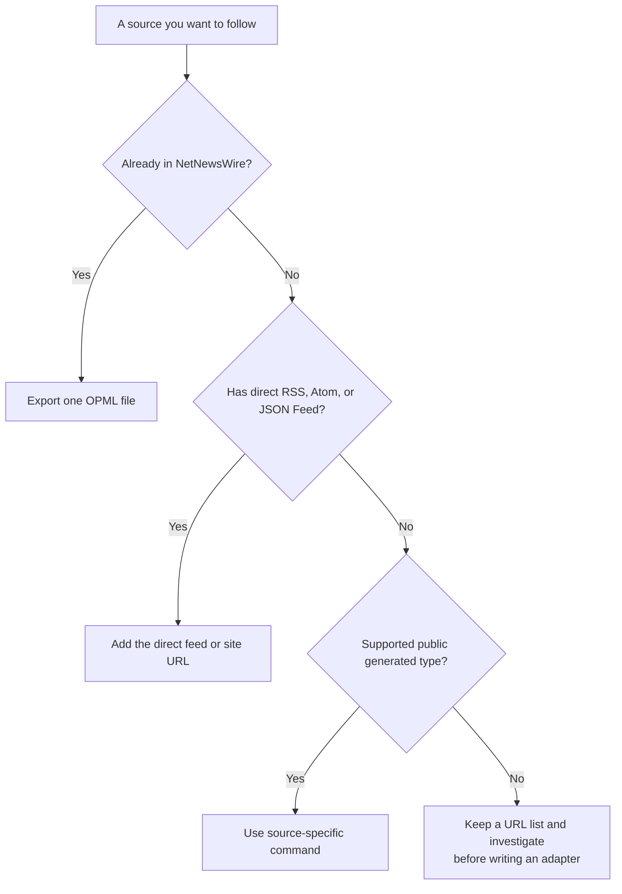

# Collect Sources

Use the least invasive input that preserves the publisher’s intended feed. A direct RSS, Atom, or JSON Feed is always preferred over a generated feed. Keep every export, URL list, and private feed inside your local `imports/` directory or ignored profile files.



## Accepted Inputs At A Glance

| Source | Best input | Accepted local format or URL | Result |
| --- | --- | --- | --- |
| Existing reader | OPML export | `imports/netnewswire.opml` | Imports current subscriptions and folders |
| YouTube, many channels | Google Takeout export | CSV named `subscriptions.csv` | Official direct channel feeds |
| YouTube, one channel | Public channel URL | `https://www.youtube.com/@example` | Resolves stable channel ID and official feed |
| Bandcamp | Root artist, label, or fan page | `https://artist.bandcamp.com/` | Generated RSS; optional HTTPS bridge |
| Substack | Publication URL | `https://publication.substack.com/` | Native `/feed` where supported |
| Podcast | Publisher RSS URL | `https://publisher.example/feed.xml` | Direct podcast feed |
| Mixcloud | Public profile root | `https://www.mixcloud.com/example/` | Generated RSS; optional HTTPS bridge |
| NTS | Public show page | `https://www.nts.live/shows/example` | Generated RSS; optional HTTPS bridge |

Do not upload or commit tokens, paid newsletters, private podcast URLs, cookies, account exports beyond what you need locally, or a copy of a platform page obtained while signed in.

## Existing NetNewsWire or Other Reader

### Get the Export

In NetNewsWire choose **File > Export Subscriptions...**, select the account, and save the `.opml` file. NetNewsWire’s official [OPML export instructions](https://netnewswire.com/help/mac/6.0/en/export-opml.html) confirm this does not change your existing subscriptions.

Save it as `imports/netnewswire.opml`. `imports/` is ignored by Git.

### Import It Into the Private Registry

```bash
PYTHONPATH=src python3 -m netnewswire_feed_booster \
  --data "data/sources.${RSS_PROFILE}.json" \
  import-opml imports/netnewswire.opml --profile "$RSS_PROFILE"
```

The command reads the local file only. Review it before writing a candidate OPML:

```bash
PYTHONPATH=src python3 -m netnewswire_feed_booster \
  --data "data/sources.${RSS_PROFILE}.json" \
  audit-sources --profile "$RSS_PROFILE" --limit 25
```

### Keep Your Own Folder Structure

Imported OPML folders are preserved as an ordered folder path. This project does not prescribe a taxonomy: use no folders, one folder, or as many nested folders as make your reader useful to you.

Source-specific commands start at the OPML root unless you deliberately provide `--group "Your Folder"`. Use `set-folder --private` when the source itself lives in the ignored private overlay.

To move one saved source, provide its exact source ID, site URL, feed URL, or unique title followed by the folder names from top level to leaf:

```bash
PYTHONPATH=src python3 -m netnewswire_feed_booster \
  --data "data/sources.${RSS_PROFILE}.json" \
  set-folder "https://www.nytimes.com" "News" "New York Times" \
  --profile "$RSS_PROFILE"
```

Omit folder names to place a source at the OPML root. Re-export after a folder change. A source appears in exactly one location in the generated OPML.

## YouTube

YouTube has official RSS feeds per channel. A channel handle such as `@example` is not the durable feed identifier, so the tool resolves and stores the stable channel ID.

### One Channel You Like

Copy a public channel URL from the browser address bar. Both a handle URL and a `/channel/UC...` URL work:

```text
https://www.youtube.com/@example
https://www.youtube.com/channel/UCxxxxxxxxxxxxxxxxxxxxxx
```

Then run:

```bash
PYTHONPATH=src python3 -m netnewswire_feed_booster \
  --data "data/sources.${RSS_PROFILE}.json" \
  import-youtube-channel-url https://www.youtube.com/@example \
  --profile "$RSS_PROFILE"
```

The stored feed is the official format:

```text
https://www.youtube.com/feeds/videos.xml?channel_id=UCxxxxxxxxxxxxxxxxxxxxxx
```

You can also add that URL manually in NetNewsWire once you know the channel ID.

### Your Existing YouTube Subscriptions

Use [Google Takeout](https://takeout.google.com/) to create a local archive. Google’s [data export guide](https://support.google.com/accounts/answer/3024190) explains how to select products and download an archive.

1. In Takeout, deselect everything you do not need, then select **YouTube and YouTube Music**.
2. Open its **All data included** options and select only subscription data when Takeout offers that choice. Do not export watch history, private playlists, uploads, or other account data for this workflow.
3. Create and download the archive to your Mac. Archive creation can take time; keep the result private.
4. In Finder, unzip it and locate the CSV named `subscriptions.csv`. It is commonly under a `YouTube and YouTube Music` folder; the exact folder nesting can vary by Takeout version.
5. Copy only that CSV to `imports/youtube-subscriptions.csv`.
6. Import it locally:

```bash
PYTHONPATH=src python3 -m netnewswire_feed_booster \
  --data "data/sources.${RSS_PROFILE}.json" \
  import-youtube-subscriptions imports/youtube-subscriptions.csv \
  --profile "$RSS_PROFILE"
```

The importer accepts the Takeout CSV columns `Channel Id`, `Channel Url`, and `Channel Title`. It also accepts a saved public subscriptions HTML page or a plain text file containing one public YouTube channel URL or channel ID per line. Do not provide watch history, private playlists, or account pages.

## Bandcamp

Copy the root public page for an artist, label, or fan account:

```text
https://artist.bandcamp.com/
https://label.bandcamp.com/
https://username.bandcamp.com/
```

Do not use an album, track, merch, collection, or URL with a query string as the source. For example, use `https://artist.bandcamp.com/`, not `https://artist.bandcamp.com/album/example`.

```bash
PYTHONPATH=src python3 -m netnewswire_feed_booster \
  --data "data/sources.${RSS_PROFILE}.json" \
  subscribe-bandcamp-source https://artist.bandcamp.com/ \
  --profile "$RSS_PROFILE"
```

The command creates a local generated RSS seed. Stop here unless you have confirmed that this source needs HTTPS hosting outside your local checkout. Deploying the hosted bridge creates or updates provider resources and may use credits; it is not part of first-time source collection. Read [Hosted Bridge](hosting.md) and [Slow Reading And Refresh Policy](reading-practice.md) before you approve `./scripts/netnewswire_workflow.sh deploy-modal`.

## Substack, Podcasts, and Other Direct Feeds

### Substack

Use the public publication root, for example `https://publication.substack.com/`. The native feed is usually `https://publication.substack.com/feed`.

```bash
PYTHONPATH=src python3 -m netnewswire_feed_booster \
  --data "data/sources.${RSS_PROFILE}.json" \
  subscribe-substack publication.substack.com \
  --title "Publication Name" --profile "$RSS_PROFILE"
```

### Podcasts

Use the publisher’s RSS URL from its website or podcast app. Do not use a share URL if the publisher exposes a real feed URL.

```bash
PYTHONPATH=src python3 -m netnewswire_feed_booster \
  --data "data/sources.${RSS_PROFILE}.json" \
  subscribe-podcast https://publisher.example/feed.xml --profile "$RSS_PROFILE"
```

### Any Public Website

Use the one-step subscription command before considering an adapter:

```bash
PYTHONPATH=src python3 -m netnewswire_feed_booster \
  --data "data/sources.${RSS_PROFILE}.json" \
  subscribe-feed-url https://example.com --profile "$RSS_PROFILE"
```

The command discovers RSS, Atom, or JSON Feed metadata before writing. It blocks strong duplicates by normalized feed URL, canonical publication URL, or overlapping stable item IDs. It also blocks same-kind, same-title probable duplicates unless you explicitly pass `--allow-possible-duplicate`. Set `NETNEWSWIRE_OPML` in the ignored private environment file, or pass `--against-opml`, to include an existing NetNewsWire subscription export in the preflight. If the page exposes no feed, keep the public source URL in a private text file and consult [Writing A Source Adapter](writing-a-source-adapter.md) before proposing generated RSS.

## Generated Public Sources

These inputs are supported but require a local command or coding agent because the project creates RSS from a public page or API:

```bash
# Public Mixcloud profile root only.
PYTHONPATH=src python3 -m netnewswire_feed_booster \
  --data "data/sources.${RSS_PROFILE}.json" \
  subscribe-mixcloud-profile https://www.mixcloud.com/example/ --profile "$RSS_PROFILE"

# Public NTS show page.
PYTHONPATH=src python3 -m netnewswire_feed_booster \
  --data "data/sources.${RSS_PROFILE}.json" \
  subscribe-nts-show https://www.nts.live/shows/example --profile "$RSS_PROFILE"
```

Generated feeds are restricted to public source shapes, refreshed on a bounded schedule, and served from cache to readers. They must not bypass a paywall, authentication, a private account, robots controls, or anti-abuse protections.
